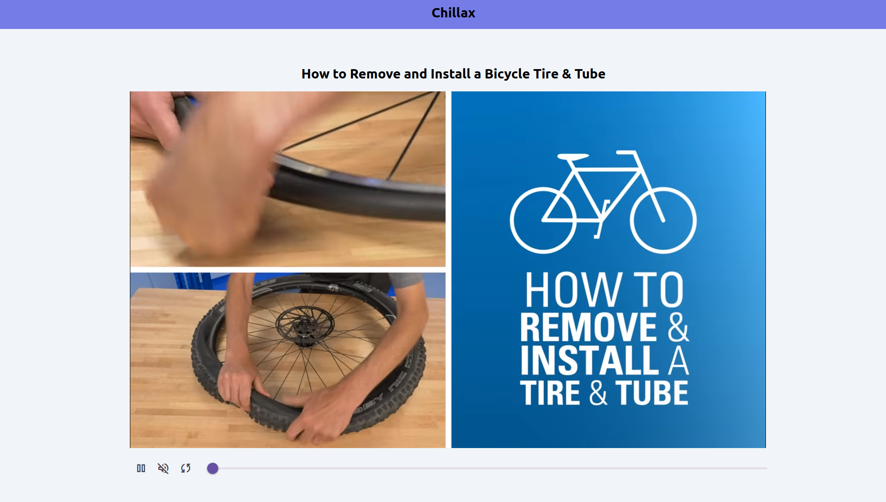

# Chillax

Chillax is a versatile software that enables you and your friends to enjoy synchronized YouTube video watching, whether you're using a single device or multiple devices. It utilizes WebSocket technology to keep all connected devices in perfect harmony, ensuring everyone watches the same video at the same time.



## Prerequisites

Before you can use Chillax, ensure that you have the following dependencies installed on your system:

1. [Golang](https://go.dev/dl/)
2. [Node.js](https://nodejs.org/en)
3. [Make](https://www.gnu.org/software/make/)

## Player Controls

:arrow_forward: Play video

:pause_button: Pause video

:loud_sound: Toggle volume on/off

:arrows_counterclockwise: Resynchronize if the player falls out of sync with other devices/browsers.

## Configuration

To configure Chillax, create a `.env` file in the `web` root directory and add the `VITE_WS_URL` variable:

```bash
VITE_WS_URL=ws://localhost:5000/ws
```

**Note** : When deploying to a production environment, replace the value with the appropriate production URL.

## Running Locally

To run the Chillax server, use the following command:

```bash
$ make server
```

To run the Chillax web interface, use the following command:

```bash
$ make web
```

## Building and Deploying

To build and run Chillax for deployment, execute the following command:

```bash
$ make up
```
